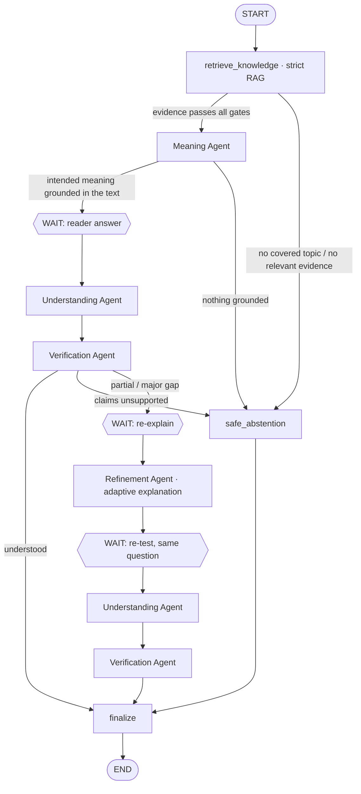

# MA'NA | مَعنى

> **Did the meaning actually arrive?** · هل وصل المعنى بأمانة؟

MA'NA measures the gap between **the meaning Islamic content intends** and **what the audience actually understood**. It proves each gap with trusted sources, diagnoses *why* the misunderstanding happened, chooses the best way to explain it again (simplification, comparison, example, visual or step by step), re-tests the reader with the same question and measures the improvement.

```
المحتوى → تحديد المعنى المقصود → اختبار الفهم → اكتشاف فجوة الفهم → التحقق بالمصادر
       → تحديد سبب الالتباس → اختيار أفضل طريقة للشرح → إعادة الشرح → إعادة الاختبار → قياس التحسن
```

> **ملاحظة للمحكّمين:** يعمل النظام بنموذج لغوي حقيقي، لذلك يحتاج مفتاح API خاصًا بكم. انسخوا `backend/.env.example` إلى `backend/.env` وضعوا المفتاح في `LLM_API_KEY`. لا توجد أي مفاتيح داخل المستودع. واجهة الموقع عربية بالكامل ومن اليمين إلى اليسار.

---

## 1. The problem

Islamic content can be linguistically correct and well translated and still be misunderstood:

> Content: *«الزكاة صدقة يخرجها المسلم من ماله.»*
> Reader: *«الزكاة تبرع يدفعه المسلم إذا أراد.»*

Every word arrived, but the meaning did not: the word «صدقة» led the reader to think Zakat is optional, while it is an obligatory pillar. MA'NA detects this, proves it from the sources, and explains it again in the way that fits the cause.

**Key principle:** MA'NA does not test the reader's Islamic knowledge. Only meanings the content itself states are scored. Background knowledge retrieved by RAG is context and never becomes a requirement.

## 2. Architecture

LLM + RAG + Multi-Agent, orchestrated by **LangGraph** with human-in-the-loop interrupts and a SQLite checkpointer.



| Agent | File | Sees | Produces |
|---|---|---|---|
| Meaning | `agents/meaning_agent.py` | content, evidence | intended concepts quoted from the content (weights sum to 1), background knowledge and ambiguities (each with a verbatim evidence quote), neutral question |
| Understanding | `agents/understanding_agent.py` | what the reader read, their answer. **No knowledge base** | neutral description of the reader's interpretation |
| Verification | `agents/verification_agent.py` | intended concepts, interpretation, evidence | gap type per concept, misunderstandings with verbatim evidence quotes; score and status computed in code |
| Refinement | `agents/refinement_agent.py` | original content, verified gaps, cited evidence | root cause, explanation strategy, new explanation (+ comparison table / steps / example / diagram), supporting quotes |

### 2.1 Adaptive explanation

The Refinement Agent diagnoses **why** the misunderstanding happened and chooses a strategy that fits the cause. Code enforces the mapping and falls back safely when the model ignores it:

| Root cause | Allowed strategies |
|---|---|
| concept_confusion (e.g. Hajj = Umrah) | comparison |
| ambiguous_wording (e.g. «صدقة» read as optional) | comparison, example |
| abstract_concept | example, visual |
| missing_context | example, step_by_step, simplification (only when nothing else adds anything) |
| complex_process | step_by_step, visual |
| overgeneralization | example, comparison |

The reader is then re-tested with **the same neutral question** as the first time, so before and after are directly comparable and the question cannot leak the answer. The re-test is scored against the same intended concepts and evidence; each earlier misunderstanding is marked *resolved*, *partially resolved* or *remains*, and newly missing meanings are reported as remaining gaps.

### 2.2 Strict RAG

`rag/pipeline.py`:

1. **Scope gate.** The planner names the exact concept (e.g. «الزكاة») and its key terms in Arabic and English. Content that is not about an Islamic concept the Qur'an or hadith address (geography, commerce, technology) abstains immediately.
2. **Hybrid search.** Multilingual dense search (FAISS cosine) over the whole corpus, plus a keyword search on Arabic-normalised text (Uthmani spellings such as «ٱلزَّكَوٰةَ» match «الزكاة») that adds the best on-concept passages from each collection.
3. **Rule filters, calibrated per collection:** the passage must mention the concept; minimum similarity `RAG_MIN_RELEVANCE=0.6` for hadith and `RAG_MIN_RELEVANCE_QURAN=0.45` for the Qur'an (the embedding model scores Uthmani script lower); relative margin `0.15` from the best on-concept passage of the same collection; one passage per hadith or ayah; near-duplicate removal.
4. **Relevance grading:** an LLM grader rejects passages about a different practice that only shares a word (e.g. voluntary fasts for content about Ramadan, Zakat al-Fitr for content about Zakat in general).
5. **At most 4 passages**, picked in turn from the Qur'an, Bukhari and Muslim by relevance. Every decision (kept / below threshold / off concept / duplicate / judged irrelevant…) is stored and shown on the technology page.

If nothing survives, the answer is **«تعذر التحقق من خلال المصادر المتاحة»**.

### 2.3 Validation between agents

`agents/base.py:call_validated` runs a validator on every agent output before it reaches the next agent:

- schema validity (Pydantic), with repair of malformed JSON and retries;
- intended concepts must be quoted from the content itself (Arabic-aware normalisation), so background facts cannot become scored meaning;
- no duplicate concepts or misunderstandings; weights normalised to sum to 1;
- one judgement per concept, no unknown IDs, no contradictions (a concept affected by a misunderstanding cannot be judged correct);
- every religious claim (background, ambiguity, confusion, ambiguity-triggered gap, refinement fact) must carry a quote that code finds **verbatim** in a cited chunk; otherwise it is rejected and logged in `rejected_claims`;
- the refinement strategy must fit the root cause and include the fields that strategy needs.

An invalid output gets one corrective retry with the exact issues listed; anything still invalid is corrected deterministically. Every validation is recorded in `validation_log`.

## 3. Evaluation

```bash
cd backend
python -m evaluation.evaluator                    # full system, real LLM
python -m evaluation.evaluator --cases id1,id2    # selected cases
python -m evaluation.evaluator --retrieval-only   # dense retrieval only, no API key
```

`evaluation/dataset.json` holds 26 cases, each with its expected outcome set in advance: correct, partial and wrong understanding, concept confusion, ambiguous content, content outside the sources' scope, irrelevant retrieval, correct abstention, unverifiable extra claims, an evasive answer, a re-test where the reader is still confused, broader coverage (prayer, inheritance), Arabic and English content. Every metric is computed in code from the real outputs; citations and quotes are re-verified independently against the source text. No LLM judges the system.

**Run of 2026-10-04** (26 cases, `gpt-4.1`, full Qur'an + Sahih al-Bukhari + Sahih Muslim corpus):

| Metric | Result |
|---|---|
| Intended Concept Extraction | 100% |
| Background leakage into intended meaning | 0% |
| Meaning Gap Detection Accuracy (status) | 100% (26/26) |
| Gap Type Accuracy | 90.9% |
| RAG scope gate accuracy | 100% |
| RAG Relevance (kept passages that are about the exact concept) | 100% |
| Irrelevant retrieval rejected (out-of-scope content) | 100% |
| Citation Correctness (97 citations re-verified) | 100% |
| Unsupported Claim Rate (74 claims re-verified) | 0% |
| Abstention Accuracy / precision / recall | 100% / 100% / 100% |
| Refinement: strategy fits the cause | 100% |
| Refinement Relevance | 100% |
| Before/After: misunderstanding resolved or partially resolved (incl. a still-confused reader correctly reported as "remains") | 100% |
| Mean alignment before → after (12 re-tested cases) | 12.5% → 91.7% (+79 points) |
| Agent outputs valid on first attempt / after correction | 93.1% / 98.0% |

Notes on this run, for transparency:

- Retrieval for `allah-word-en` ("Allah is the Arabic word for God") is not fully stable on this corpus: in this run it found Qur'an evidence, while an earlier run abstained.
- The two gap-type misses are `zakat-sadaqa-word-ar` (judged "distorted meaning" where "ambiguity triggered by the wording" was expected) and `fasting-diet-en` (judged "missing intended meaning" where "distorted meaning" was expected); both statuses were correct.
- Explanation strategies chosen in this run: comparison 8, example 2, step by step 2.
- The model is non-deterministic, so repeated runs can differ slightly.

Running the evaluator writes per-case output to `evaluation/results/latest.json` and a summary to `evaluation/results/latest.md`.

Automated tests (fake LLM, real FAISS index): graph flow, validators, quote verification, strict retrieval filters, strategy correction, Arabic API errors.

```bash
cd backend && python -m pytest -q
```

## 4. Running locally

Requirements: Python 3.12+, Node 18+.

```bash
cd backend
python -m venv .venv
.venv\Scripts\activate            # macOS/Linux: source .venv/bin/activate
pip install -r requirements.txt
copy .env.example .env            # macOS/Linux: cp .env.example .env, then set LLM_API_KEY
python -m rag.ingest
uvicorn main:app --port 8000
```

```bash
cd frontend
copy .env.example .env.local      # NEXT_PUBLIC_API_URL=http://localhost:8000
npm install
npm run dev                       # http://localhost:3000
```

### Environment variables (`backend/.env`)

| Variable | Meaning |
|---|---|
| `LLM_PROVIDER` | `openai` (or any OpenAI-compatible API with `LLM_BASE_URL`), `gemini`, `anthropic` |
| `LLM_API_KEY` | your key (required) |
| `LLM_MODEL` | optional; provider default otherwise |
| `LLM_BASE_URL` | optional, for OpenAI-compatible providers |
| `LLM_TEMPERATURE`, `LLM_TIMEOUT` | generation settings |
| `EMBEDDING_PROVIDER`, `EMBEDDING_MODEL` | `local` multilingual ONNX model by default (no key) |
| `RAG_TOP_K`, `RAG_MIN_RELEVANCE`, `RAG_RELATIVE_MARGIN` | retrieval strictness (4, 0.5, 0.15) |
| `APP_ENV` | `production` uses only sources with `review_status: reviewed` |
| `DEMO_MODE` | exposes sample inputs on the analyze page |
| `CORS_ORIGINS` | allowed frontend origins |

## 5. Knowledge base

The knowledge base is the full text of three collections, defined in `backend/data/corpus.json` and downloaded by `python -m rag.ingest` into `backend/data/raw/` (not committed):

| Collection | Passages | Source and license |
|---|---|---|
| The Holy Qur'an, Uthmani text | 6,236 ayahs | [Tanzil.net](https://tanzil.net), Creative Commons Attribution 3.0, used verbatim. Surah names and ayah numbers come from Tanzil's official metadata |
| Sahih al-Bukhari (Arabic + English translation) | 7,567 passages | [SENODROOM/sahih-al-bukhari](https://github.com/SENODROOM/sahih-al-bukhari), AGPL-3.0 |
| Sahih Muslim (Arabic + English translation) | 7,698 passages | [SENODROOM/sahih-muslim](https://github.com/SENODROOM/sahih-muslim), AGPL-3.0 |

Each ayah is one passage; each hadith is one passage (the few hadith longer than 1,800 characters are split into parts). Hadith numbers are the numbers **in the source edition**, which do not always match the commonly used numbering (e.g. Fuad Abdul Baqi for Muslim); citations say so explicitly. The hadith files are AGPL-3.0, so they are downloaded at index time rather than redistributed in this repository. Indexing 21,501 passages on a CPU takes about 25 minutes and needs roughly 1 GB of RAM.

## 6. Deployment

- **Backend → Render:** `render.yaml` (build, ingestion, start). Set `LLM_API_KEY` in the dashboard and `CORS_ORIGINS` to the frontend URL. Building the index downloads the corpus and embeds 21,501 passages (about 25 minutes, roughly 1 GB of RAM), so use an instance with at least 1 GB of memory, or build `backend/data/index/` locally and ship it with the service.
- **Frontend → Netlify:** base directory `frontend`, `netlify.toml` builds the static export; set `NEXT_PUBLIC_API_URL` to the backend URL.

## 7. Project structure

```
maana-ai/
├── backend/
│   ├── agents/        meaning, understanding, verification, refinement, validation helpers, text normalisation
│   ├── graph/         LangGraph workflow, state, live progress
│   ├── rag/           ingestion, embeddings, retriever, strict pipeline
│   ├── llm/           provider-independent client
│   ├── scoring/       Meaning Alignment Score
│   ├── evaluation/    dataset, evaluator, results
│   ├── db/, services/ dashboard persistence
│   ├── api/           FastAPI routes (Arabic error messages)
│   ├── data/          sources and demo inputs
│   └── tests/
├── frontend/          Next.js 14 static export, TypeScript, Tailwind, Arabic RTL UI
└── render.yaml
```

**API:** `POST /api/content/analyze` · `POST /api/understanding/analyze` · `POST /api/content/refine` · `POST /api/understanding/retest` · `GET /api/session/{id}` · `GET /api/session/{id}/progress` · `GET /api/dashboard` · `GET /api/sources` · `GET /api/demo` · `GET /api/health`
